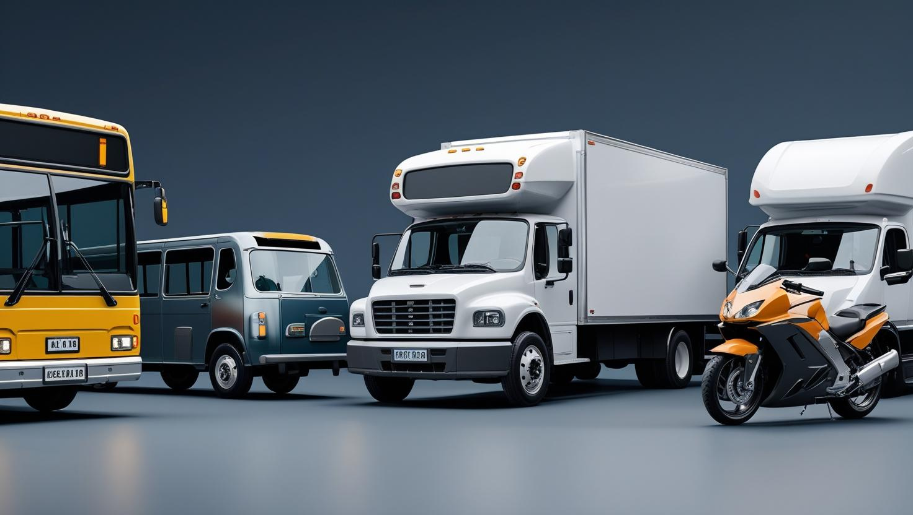

# Vehicle Object Detection and License Plate Recognition (LPR) System



## Repository Overview

```
.
├── AEGISLENS_EDA_ENG.ipynb           # Exploratory Data Analysis in English
├── AEGISLENS_EDA_ID.ipynb            # Exploratory Data Analysis in Indonesian
├── Archive/                          # Archived files or previous versions
├── data.yaml                         # YOLO dataset configuration file
├── demo1.avi                         # Sample demo video for testing
├── Deployment/                       # Scripts or configs related to model deployment
├── inference.py                      # Inference script using trained YOLO model
├── latest.pt                         # Trained YOLO model weights
├── metrics/                          # Evaluation metrics and visualizations
├── ocr_plate.ipynb                   # OCR pipeline for plate recognition
├── README.md                         # Project overview and instructions
├── References/                       # External references or citations
├── requirements.txt                  # Python dependencies
├── splitting.py                      # Script to split dataset/video frames
├── take_frames_from_video.ipynb      # Notebook to extract frames from video
├── test.MOV                          # Test video sample
├── test2.MOV                         # Another test video sample
└── yolo_implementation.ipynb         # YOLOv5 implementation and training notebook

```

## Project Description

This system combines YOLO (You Only Look Once) object detection with license plate recognition to:

1. Detect vehicles in images/video streams
2. Identify vehicle classes (car, truck, motorcycle, etc.)
3. Optionally recognize license plate details including expiration date

## How to Run Inference

### 1. Initial Setup

#### Create and activate virtual environment:
```bash
python -m venv venv
source venv/bin/activate  # Linux/Mac
.\venv\Scripts\activate   # Windows
```

#### Install dependencies:
```bash
pip install -r requirements.txt
```

### 2. Running Detection

#### Basic Command Structure:
```bash
python inference.py \
    --model <model_path> \
    --source <input_source> \
    [--thresh <confidence_threshold>] \
    [--resolution <WxH>] \
    [--record]
```

### 3. Detailed Arguments

| Argument | Description | Required | Default |
|----------|-------------|----------|---------|
| `--model` | Path to YOLO model file (e.g., "runs/detect/train/weights/best.pt") | Yes | - |
| `--source` | Input source: <br>- Image file ("test.jpg") <br>- Image folder ("test_dir") <br>- Video file ("testvid.mp4") <br>- USB camera ("usb0") <br>- Picamera ("picamera") | Yes | - |
| `--thresh` | Minimum confidence threshold (0.0 to 1.0) | No | 0.5 |
| `--resolution` | Display resolution in WxH format (e.g., "640x480") | No | Source resolution |
| `--record` | Record and save output as "demo.avi" (requires --resolution) | No | False |

### 4. Usage Examples

**Basic image detection:**
```bash
python inference.py --model latest.pt --source test.jpg
```

**Webcam detection with custom threshold:**
```bash
python inference.py --model latest.pt --source usb0 --thresh 0.7
```

**Video processing with recording:**
```bash
python inference.py --model latest.pt --source traffic.mp4 --resolution 1280x720 --record
```

**Batch process image folder:**
```bash
python inference.py --model latest.pt --source images/ --thresh 0.6
```

### 5. Important Notes

1. For recording (`--record`), you must specify `--resolution`
2. Camera indices start from 0 (e.g., "usb0" for first USB camera)
3. Confidence threshold (`--thresh`) filters out low-confidence detections
4. Supported image formats: JPG, PNG, BMP
5. Supported video formats: MP4, AVI, MOV

### 6. Troubleshooting

**Webcam not working:**
- Try different indices ("usb0", "usb1", etc.)
- Verify camera permissions
- Check if OpenCV can access the camera:
  ```python
  import cv2
  cap = cv2.VideoCapture(0)
  print(cap.isOpened())
  ```

# Graphical User Interface (GUI) Application
Run the interactive desktop application with:
```
python UIApp/main_app.py
```

## Installation

### Prerequisites
- Python 3.8+
- NVIDIA GPU (recommended)
- CUDA/cuDNN (for GPU acceleration)

### Setup
1. Clone repository:
   ```bash
   git clone https://github.com/yourusername/vehicle-plate-detection.git
   cd vehicle-plate-detection
   ```

2. Install dependencies:
   ```bash
   pip install -r requirements.txt
   ```

## Applications

- Automated vehicle verification systems
- Parking management
- Traffic monitoring
- Insurance fraud detection
- Expired plate detection 

Project Link: [click here](https://github.com/vikesaki/AegisLens#)

Deployment Link: [click here](https://aegislens.streamlit.app/)

## License
This project is licensed under the **MIT License** - see the [LICENSE](LICENSE) file for details.   

**You must**:  
- Include original license  
- Maintain copyright notice

**No warranty** is provided. Use at your own risk.

## Contributors
- [@github1](link) - Role (contact@email.com)  
- [@github2](link) - Role (contact@email.com)
- [@github1](link) - Role (contact@email.com)  
- [@github2](link) - Role (contact@email.com)
- [@github1](link) - Role (contact@email.com)    
